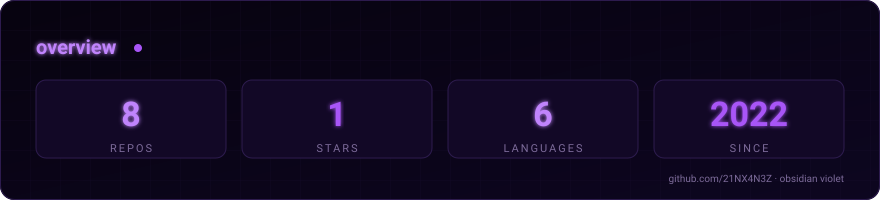
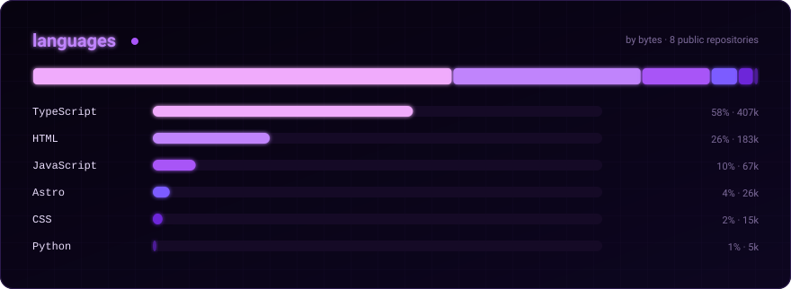

<pre>
┌─[ selected-work ]─────────────────────────────────────────────────────┐
│  eco-forge           AI carbon engineering · CBAM      live           │
│  fsae-cost-web       FSAE/BAJA cost reports, autocalc  react · vite   │
│  bp18-dashboard      frame + body command center       next · mongodb │
│  x4n3z-3d-portfolio  3D spaceframe portfolio, R3F      r3f · vite     │
└───────────────────────────────────────────────────────────────────────┘
</pre>

KMUTT APE/TME · BlackPearl FSAE — Frame &amp; Body · TypeScript / React / Next.js

  

<a href="https://github.com/21NX4N3Z/eco-forge">eco-forge</a> · <a href="https://github.com/21NX4N3Z/fsae-cost-web">fsae-cost-web</a> · <a href="https://github.com/21NX4N3Z/bp18-dashboard">bp18-dashboard</a> · <a href="https://github.com/21NX4N3Z/x4n3z-3d-portfolio">x4n3z-3d-portfolio</a> · <a href="https://github.com/21NX4N3Z/x4n3z-portfolio">x4n3z-portfolio</a> · <a href="https://github.com/21NX4N3Z/ClubBot">ClubBot</a>

